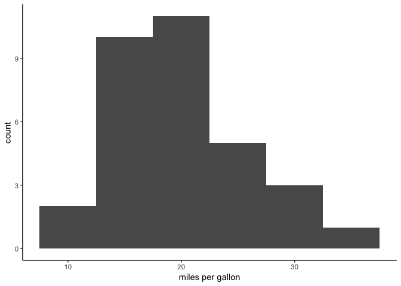
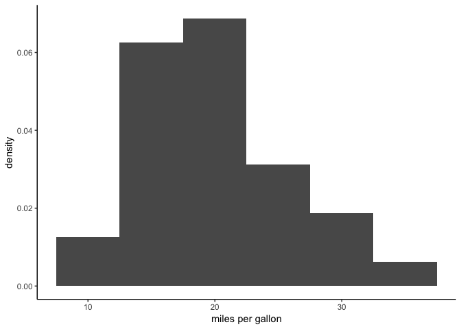
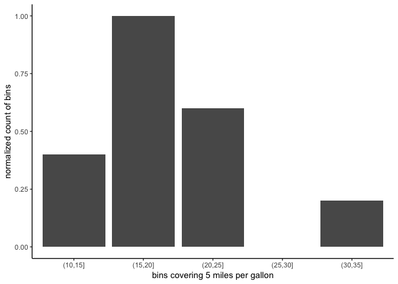
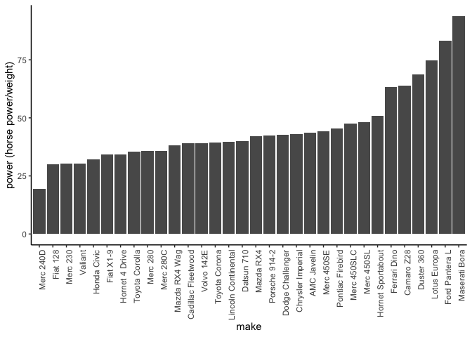
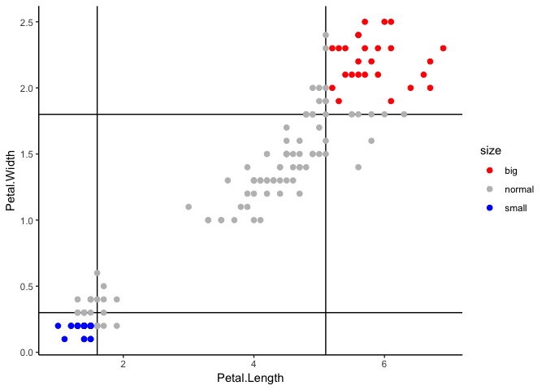
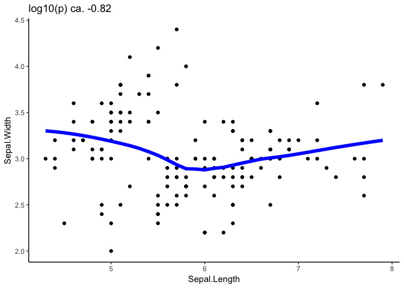
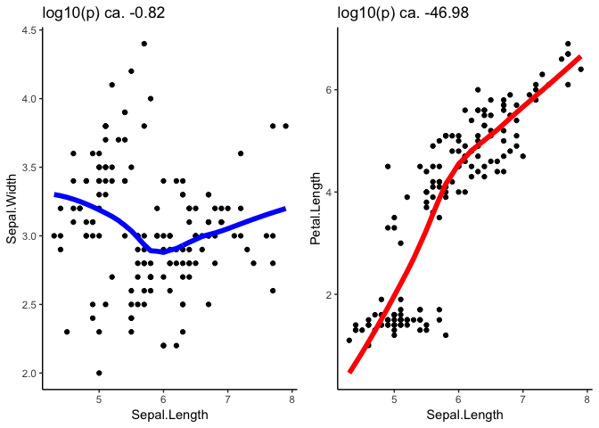
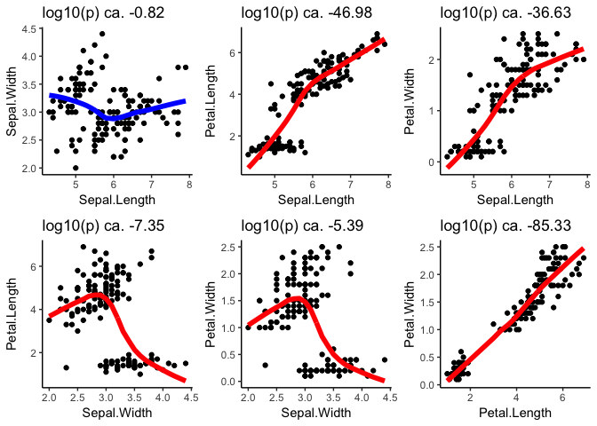
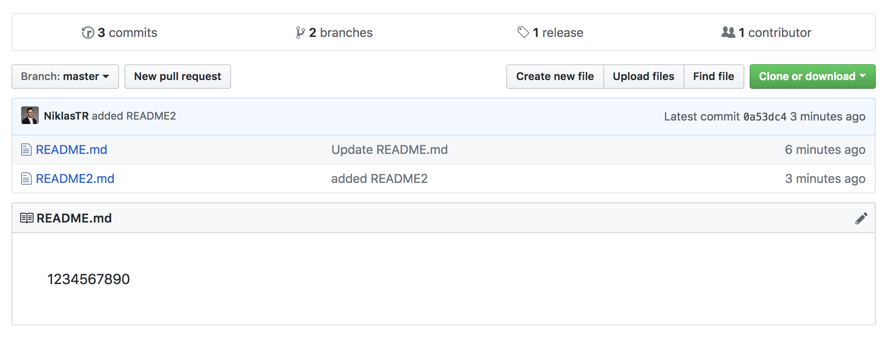

BMI 713/BMIF 313qc Problem Set 2 Solution
================
Niklas Rindtorff
2018-09-20

Overview:
=========

#### Learning Goals

After attending lecture/labs and completing this problem set you should be able to do the following:

-   write a complete R program with conditionals and iterations, functions, including plotting but no reading/writing of files, etc. which will be covered later
-   understand relationship between R, R studio, package installation, package/library include in code, R console output, R script and R markdown script
-   understand and apply algorithmic thinking to write pseudo-code
-   know how to use the help functions and find commands etc.
-   initialize a git repo, add files, remove files, commit, push, pull, and tag

#### Instructions:

You are to complete and turn in this problem set by **Thursday September 20 at 9:44 am**. The final problem will show you how to turn in your problem set.

All code should be included in the submission, and should be saved in an *r markdown* file. Any answers should be included as comments immediately below the code responsible, and should be labelled as follows:

``` r
# CODE 2a
Put your code here
and if you need another line, put it here,
and also here!
```

When plotting *remember to appropriately label your axes*

Exercise 1 (18 points)
----------------------

Data Exploration with the mtcars dataset. The built-in dataset, `mtcars` includes data from the *Motor Trend* magazine for 1973-74 models of thirty-two automobiles on eleven different variables.

``` r
head(mtcars)
```

    ##                    mpg cyl disp  hp drat    wt  qsec vs am gear carb
    ## Mazda RX4         21.0   6  160 110 3.90 2.620 16.46  0  1    4    4
    ## Mazda RX4 Wag     21.0   6  160 110 3.90 2.875 17.02  0  1    4    4
    ## Datsun 710        22.8   4  108  93 3.85 2.320 18.61  1  1    4    1
    ## Hornet 4 Drive    21.4   6  258 110 3.08 3.215 19.44  1  0    3    1
    ## Hornet Sportabout 18.7   8  360 175 3.15 3.440 17.02  0  0    3    2
    ## Valiant           18.1   6  225 105 2.76 3.460 20.22  1  0    3    1

I load a set of packages.

### 1.1 (8 pts)

(5 pts) Create a basic historgram with x- and y-labels to show the distribution of fuel efficiency (mpg) in the data set. Normalize the mpg data so that the frequency falls on a scale from 0 to 1.

(3 pts) Which range of mpg is the most frequent? The least frequent?

``` r
# Create Histogram
mtcars %>% 
  ggplot(aes(mpg)) + 
  geom_histogram(binwidth = 5) + 
  theme_classic() + 
  labs(x = "miles per gallon",
       y = "count")
```



``` r
# I can also generate a density histogram
mtcars %>% 
  ggplot(aes(mpg, ..density..)) + 
  geom_histogram(binwidth = 5) + 
  theme_classic() + 
  labs(x = "miles per gallon",
       y = "density")
```



``` r
#Now I calculate and plot the normalized data by bins of 5 mpg.
mtcars %>%
  #I create bins of width 5 and normalize their count according to the instruction.
  mutate(bin=cut(mpg, breaks = seq(10,40, by = 5))) %>% 
  group_by(bin) %>% 
  summarise(count = n()) %>% 
  mutate(norm_count = (count-min(count))/max((count-min(count)))) %>%
  ggplot(aes(bin, norm_count)) + 
  geom_bar(stat = "identity") + 
  theme_classic() + 
  labs(x = "bins covering 5 miles per gallon",
       y = "normalized count of bins")
```



``` r
# ANSWER 1.1
#I generate a standard histogram using the geom_hist geom of ggplot. 
#I manually set the binwidth to be 5mpg, as this produces an easy 
#to interpret output. 
#Next I normalize the counts of previously defined bins using the 
#summarize function of dplyr. 
#I then mutate this data for normalization and present the results 
#in a histogram like barchart.
#The range of 15-20 mpg is the most frequent in this dataset and 
#under the described binning conditions. Cars with a fuel consumption
#of 35-30 miles per gallon are the least frequent group in the dataset.
```

### 1.2 (3 pts)

Create a new data.frame, *cars\_new*, that has two new columns, *make* and *pow*, where *make* stores the make of the car and *pow* stores the power-to-weight ratio (i.e. hp to weight) for each car

*Note* The dataset stores the make of the car as the data frame's row names

``` r
# Create the new data.frame with new fields
cars_new <- mtcars %>% 
  tibble::rownames_to_column("make") %>% 
  mutate(pow = hp/wt) %>% 
  #I give the dataframe its columns back
  mutate(make_id = make) %>% 
  as.data.frame() %>% 
  column_to_rownames("make_id")

head(cars_new)
```

    ##                                make  mpg cyl disp  hp drat    wt  qsec vs
    ## Mazda RX4                 Mazda RX4 21.0   6  160 110 3.90 2.620 16.46  0
    ## Mazda RX4 Wag         Mazda RX4 Wag 21.0   6  160 110 3.90 2.875 17.02  0
    ## Datsun 710               Datsun 710 22.8   4  108  93 3.85 2.320 18.61  1
    ## Hornet 4 Drive       Hornet 4 Drive 21.4   6  258 110 3.08 3.215 19.44  1
    ## Hornet Sportabout Hornet Sportabout 18.7   8  360 175 3.15 3.440 17.02  0
    ## Valiant                     Valiant 18.1   6  225 105 2.76 3.460 20.22  1
    ##                   am gear carb      pow
    ## Mazda RX4          1    4    4 41.98473
    ## Mazda RX4 Wag      1    4    4 38.26087
    ## Datsun 710         1    4    1 40.08621
    ## Hornet 4 Drive     0    3    1 34.21462
    ## Hornet Sportabout  0    3    2 50.87209
    ## Valiant            0    3    1 30.34682

### 1.3 (7 pts)

(2 pts) Sort the dataframe by horsepower-to-weight ratio from lowest to highest.

(5 pts) Create a bar plot showing the make of each car vs. the power-to-weight ratio for each car using the ordered data.

*Hint* look into the barplot arguement "las" and "cex.names" to make the x-axis more legible

``` r
# Sort by power to weight
cars_new_sorted <- cars_new %>% 
  arrange(pow) 

cars_new_sorted%>% 
  head()
```

    ##          make  mpg cyl  disp  hp drat    wt  qsec vs am gear carb      pow
    ## 1   Merc 240D 24.4   4 146.7  62 3.69 3.190 20.00  1  0    4    2 19.43574
    ## 2    Fiat 128 32.4   4  78.7  66 4.08 2.200 19.47  1  1    4    1 30.00000
    ## 3    Merc 230 22.8   4 140.8  95 3.92 3.150 22.90  1  0    4    2 30.15873
    ## 4     Valiant 18.1   6 225.0 105 2.76 3.460 20.22  1  0    3    1 30.34682
    ## 5 Honda Civic 30.4   4  75.7  52 4.93 1.615 18.52  1  1    4    2 32.19814
    ## 6   Fiat X1-9 27.3   4  79.0  66 4.08 1.935 18.90  1  1    4    1 34.10853

``` r
# Create bar plot
cars_new_sorted %>% 
  #I turn the make into a factor and rearrange the factos levels by pow
  mutate(make = factor(make, levels = make)) %>% 
  ggplot(aes(make, pow)) + 
  geom_bar(stat = "identity") + 
  theme_classic() + 
  labs(y = "power (horse power/weight)",
       x = "make") + 
  theme(axis.text.x = element_text(angle = 90, hjust = 1))
```



``` r
#For both operations I used the functions in the tidyverse package. 
#The arrange function returns a descinding sorted dataframe per default.
#I use the geom_bar geom to create a barblot. 
#To conserve the arrangement of makes, I have to convert them to 
#factors and reorder them accordingly. 
```

Exercise 2 (22 pts)
-------------------

### 2.1 (11 pts)

Using the function **quantile()**, consider the dataset **iris** and create a new field that color codes the elements of the dataframe as:

-   'blue': small elements showing both petal length and width below their first quartiles (i.e. quantile 0.25 calculated for each)
-   'red': large elements showing both petal length and width above their third quartiles (i.e. quantile 0.75 calculated for each)
-   'grey': normal elments showing either petal length or width between their first and third quartiles

Write pseudo code to display a scatterplot comparing the petal lengths and widths. Show the steps necessary to color the petals based on the classification described above

``` r
--- WRITE PSEUDO CODE HERE ---
calculate quantiles of petal length in iris, store as qpl
calculate quantiles of petal width in iris, store as qpw

mutate new variable "color" in iris, store as iris_cat
  if petal length smaller than pql-25% AND 
petal width smaller than pql-25% set color to "blue" else
  if petal length greater than pql-75% AND 
petal width greater than pql-75% set color to "red"  else
    set color to "grey"

plot iris_cat with aesthetics petal length, petal width and color,
use point geom
```

### 2.2 (11 pts)

Create a scatterplot comparing the petal lengths and widths. Show the steps necessary to color the three categories of petals as follows:

-   blue for 'small' elements
-   red for 'large' elements
-   grey for 'normal' elements

In your actual code, use filled points (i.e. pch=19), e.g. `plot(arg, arg, ..., pch = 19)`. Add proper title, axes labels and legend at the bottom-right corner of the figure for the three classes.

Using `?plot` will tell you how to add a plot title and axis labels. You can add the legend using the function, `legend` as follows: `legend("bottomright",[vector of data labels], [vector of color codes], pch=19)`

``` r
# Create column for small/normal/large colors
p_length_q <- quantile(iris$Petal.Length)
p_width_q <- quantile(iris$Petal.Width)

iris_cat <- iris %>% 
  mutate(size = case_when(Petal.Length < p_length_q[2] & Petal.Width < p_width_q[2] ~ "small",
                          Petal.Length > p_length_q[4] & Petal.Width > p_width_q[4] ~ "big",
                          # between(Petal.Length, p_length_q[2],  p_length_q[4]) | 
                          #   between(Petal.Width, p_width_q[2],  p_width_q[2]) ~ "normal", 
                          ### I interpret the definition for "normal" predals to inlcude also 
                          ### data points that are directly in the quantile "edge". 
                          TRUE ~ "normal"))
# Create scatterplot
iris_cat %>% 
  ggplot(aes(Petal.Length, Petal.Width, color = size)) + 
  # For ease of intrepretation, I include quantile boundaries in the plot canvas.
  geom_vline(xintercept = p_length_q[2]) + 
  geom_vline(xintercept = p_length_q[4]) + 
  geom_hline(yintercept = p_width_q[2]) + 
  geom_hline(yintercept = p_width_q[4]) + 
  geom_point(size = 2) + 
  theme_classic() + 
  scale_color_manual(values = c("red", "grey", "blue"))
```



``` r
# add legend

# I use the dplyr function case_when to create a new variable "size" based on multiple
# logical conditions. I then use ggplot to create a scatterplot as shown below.
```

Exercise 3 (54 pts)
-------------------

The iris dataset has a set of 4 numeric columns. Create a simple scatter plot for every possible pair of numeric columns in the dataset (6 plots in total) using a for loop. Do not plot pairs composed by the same variable on X and Y and plot X VS Y only once (do not plot Y VS X).

Display the plot as a 2X3 panel and name the axes appropriately for every pair. Add a non-linear trend line with line width 2 (see ?lowess). The main title of each plot should report the p-value of the pearson correlation test. If the test result is not significant at alpha 0.05, draw the trend line in blue, otherwise red.

Hint 1: The functions `colnames`, `setdiff()`, `combn`maybe helpful in answering this question. Hint 2: The function, `lowess` can be used to perform the fitting. Hint 3: The function, `cor.test()$[desired component]` can be used to perform and extract results of a correlation test. Hint 4: Use the function, `par(mfrow=[vector of  rows and columns of figure])` to create a figure with subplots.

1.  (6 pts) Write a list of instructions to solve this problem step-by-step in English for the first column pair, **Sepal Length and Sepal Width**.

``` r
<!-- List of instructions for single pair -->
- select the two variables for the downstream analysis 
- calculate the pearson correlation for the two features
- define a color variable with a logical based on the p.value of the correlation test
- fit a lowess model and predict fit
- use the grammar of graphics to prepare a plot that fulfills all the above requierements
```

1.  (6 pts) Now translate your instructions from part a into pseudocode

``` r
<!-- Pseudo code for single pair -->
deselect Species from iris assign to df
select Sepal.Length and Sepal.Width from iris, assign to df_tmp
calculate lowess fit from df column 1 and df column 2, assign to lowm
calculate pearson-correlation from df1 column 1 and df column 2, assign p-value to pval
if pval is smaller than 0.05 set color variable to "red" else "blue"

plot df with aesthetics petal length, petal width and color,
use point geom
add line geom with lowm
add axis-labels
round pval and add as title
```

1.  (6 pts) Now translate your pseudocode into actual running code

``` r
# Follow instructions for single pair
# First I remove the species information
df <- iris %>% 
  dplyr::select(-Species)
#Then I subset my two variables of interest 
df_tmp <-df[,c(1,2)]
#Now I calculate the lowess model
lowm <- lowess(df_tmp[,1], df_tmp[,2]) %>% enframe() %>% 
  spread(name, value) %>% 
  unnest(x, y)
#I estiamte the p-value of my pearson correlation
pval <- cor.test(df_tmp[,1], df_tmp[,2], method = "pearson") %>% broom::glance() %>% .$p.value
if(pval < 0.05){pcolor = "red"} else {pcolor = "blue"}  
#I generate a scatter plot
p <- ggplot(df_tmp, aes_string(colnames(df_tmp)[1], colnames(df_tmp)[2])) + 
  geom_point() + 
  labs(x = colnames(df_tmp)[1],
       y = colnames(df_tmp)[2]) + 
  theme_classic() + 
  geom_line(data = lowm, aes(x, y), size = 2, color = pcolor) + 
  ggtitle(paste0("log10(p) ca. ", round(log10(pval), 2)))

p
```



1.  (18 pts) Repeat steps a - c for the first two column pairs, **Sepal Length and Sepal Width** and **Sepal Length and Petal Length**.

``` r
<!-- List of instructions for two pairs -->
- create a combination matrix of the combination for the first two pairs of columns
- generate an index based on the matrix that can be looped over
- prepare an empty list to store individual plots
- prepare a for loop to run the following for every pair of columns:
  - select the two variables for the downstream analysis 
  - calculate the pearson correlation for the two features
  - define a color variable with a logical based on the p.value of the correlation test
  - fit a lowess model and predict fit
  - use the grammar of graphics to prepare a plot that fulfills all the above requierements
  - store the plot as an element in the list of plots
- arrange the subplots in the plot list to generate the desired output
```

``` r
<!-- Pseudo code for two pairs -->
create 2x2 matrix with vector "1,2,1,3", assign to index
deselect Species from iris assign to df
create empty list "gg_list"
for i in column number of index
select columns 
  "element 1 of column i of index " and 
  "element 2 of column i of index " from iris, assign to df_tmp
calculate lowess fit from df column 
  "element 1 of column i of index " and df column 
  "element 2 of column i of index ", assign to lowm
calculate pearson-correlation from df1 column 
  "element 1 of column i of index " and df column 
  "element 2 of column i of index ", assign p-value to pval
if pval is smaller than 0.05 set color variable to "red" else "blue"

  plot df with aesthetics petal length, petal width and color,
  use point geom
  add line geom with lowm
  add axis-labels
  round pval and add as title
  store plot as element i in "gg_list"

plot all elements of gg_list
```

``` r
# Follow instructions for first two pairs
# Get all combinations
index <- matrix(c(1,2,1,3), ncol =2) #The first two pairs

# Set up subplot
df <- iris %>% 
  dplyr::select(-Species)
  
gg_list <- list()

for(ii in 1:ncol(index)){
  df_tmp <-df[,index[,ii]]
  lowm <- lowess(df_tmp[,1], df_tmp[,2]) %>% enframe() %>% 
    spread(name, value) %>% 
    unnest(x, y)
  pval <- cor.test(df_tmp[,1], df_tmp[,2], method = "pearson") %>% broom::glance() %>% .$p.value
  if(pval < 0.05){pcolor = "red"} else {pcolor = "blue"}  
  
  p <- ggplot(df_tmp, aes_string(colnames(df_tmp)[1], colnames(df_tmp)[2])) + 
    geom_point() + 
    labs(x = colnames(df_tmp)[1],
         y = colnames(df_tmp)[2]) + 
    theme_classic() + 
    geom_line(data = lowm, aes(x, y), size = 2, color = pcolor) + 
    ggtitle(paste0("log10(p) ca. ", round(log10(pval), 2)))
  
  gg_list[[ii]] <- p
    
}

gg_list[[1]] + 
  gg_list[[2]] + 
  plot_layout(ncol = 2)
```



1.  (18 pts) Now, repeat steps a - c for all six combinations of numeric columns.

``` r
# Get all combinations
index <- combn(x = 4, #4 unique columns
               m = 2) #2 values in one instance

# Set up subplot
df <- iris %>% 
  dplyr::select(-Species)
  
gg_list <- list()

for(ii in 1:ncol(index)){
  df_tmp <-df[,index[,ii]]
  lowm <- lowess(df_tmp[,1], df_tmp[,2]) %>% enframe() %>% 
    spread(name, value) %>% 
    unnest(x, y)
  pval <- cor.test(df_tmp[,1], df_tmp[,2], method = "pearson") %>% broom::glance() %>% .$p.value
  if(pval < 0.05){pcolor = "red"} else {pcolor = "blue"}  
  
  p <- ggplot(df_tmp, aes_string(colnames(df_tmp)[1], colnames(df_tmp)[2])) + 
    geom_point() + 
    labs(x = colnames(df_tmp)[1],
         y = colnames(df_tmp)[2]) + 
    theme_classic() + 
    geom_line(data = lowm, aes(x, y), size = 2, color = pcolor) + 
    ggtitle(paste0("log10(p) ca. ", round(log10(pval), 2)))
  
  gg_list[[ii]] <- p
    
}

# Plot every combination
gg_list[[1]] + 
  gg_list[[2]] + 
  gg_list[[3]] + 
  gg_list[[4]] + 
  gg_list[[5]] + 
  gg_list[[6]] + 
  plot_layout(ncol = 3)
```



Question 4 (10 pts)
-------------------

### Version control with Git

This question will take you through the process of sharing results via Git. Much of it can be done with GitHub desktop, but parts will require a little bit of work in the command line.

Note: if you are already familiar with git, you may use the command line to do the same functionality. Also, Github Desktop only works on Mac or Windows; if your computer uses a different OS, you will need to use the command line and take a screen shot

*To provide screenshots use the following function in the code blocks below but remove eval = F*

``` r
# Screenshot of cloned repo


```


### 4a. Create your repo (1 pt)

Login to Github.com and create a public repository with a README file as we did in lecture on 9/11.

### 4b. Clone your repo (1 pt)

Clone your new repo to your computer.

### 4c. Edit files (1 pt)

1.  Working in the master branch of your repository, edit the `README` file to contain a new line with the number sequence: `1234567890`.

### 4d. Commit and Push (1 pt)

When you have made some or all necessary changes, commit and push them to the online repository. First, ensure all changes you would like to make are checked in GD's left window and be sure to add a summary of your changes.

### 4e. Create a new branch (1 pt)

As we did in lecture, create a new branch of your repository and name it, `Second Branch`

### 4f. Add a .txt file to the second branch (1 pt)

Add to your second branch a text file and name it `README2.md`.

### 4g. Publish your branch to the web (1 pt)

### 4h. Merge your new branch into the master branch (1 pt)

Now, merge Second Branch Into the Master Branch

### 4i. Tag your commit (1 pt)

Tag your commit on Github.com as `Final Draft`

### 4j. Provide us with the link to your repo (1 pt)

Copy and paste the link to your repo here

``` r
<!-- Link to Repo -->
https://github.com/NiklasTR/tmp
```

Question 5 (1 pts)
------------------

How long did this problem set take you to complete? **4 hours**

Submission
----------

Please knit your markdown file and submit **both** the markdown file and the knitted pdf to canvas

Appendix
========

``` r
sessionInfo()
```

    ## R version 3.5.1 (2018-07-02)
    ## Platform: x86_64-apple-darwin15.6.0 (64-bit)
    ## Running under: macOS High Sierra 10.13.6
    ## 
    ## Matrix products: default
    ## BLAS: /Library/Frameworks/R.framework/Versions/3.5/Resources/lib/libRblas.0.dylib
    ## LAPACK: /Library/Frameworks/R.framework/Versions/3.5/Resources/lib/libRlapack.dylib
    ## 
    ## locale:
    ## [1] en_US.UTF-8/en_US.UTF-8/en_US.UTF-8/C/en_US.UTF-8/en_US.UTF-8
    ## 
    ## attached base packages:
    ## [1] stats     graphics  grDevices utils     datasets  methods   base     
    ## 
    ## other attached packages:
    ##  [1] bindrcpp_0.2.2  modelr_0.1.2    patchwork_0.0.1 forcats_0.3.0  
    ##  [5] stringr_1.3.1   dplyr_0.7.6     purrr_0.2.5     readr_1.1.1    
    ##  [9] tidyr_0.8.1     tibble_1.4.2    ggplot2_3.0.0   tidyverse_1.2.1
    ## 
    ## loaded via a namespace (and not attached):
    ##  [1] Rcpp_0.12.18     cellranger_1.1.0 pillar_1.3.0     compiler_3.5.1  
    ##  [5] plyr_1.8.4       bindr_0.1.1      tools_3.5.1      digest_0.6.17   
    ##  [9] lubridate_1.7.4  jsonlite_1.5     evaluate_0.11    nlme_3.1-137    
    ## [13] gtable_0.2.0     lattice_0.20-35  pkgconfig_2.0.2  rlang_0.2.2     
    ## [17] cli_1.0.0        rstudioapi_0.7   yaml_2.2.0       haven_1.1.2     
    ## [21] withr_2.1.2      xml2_1.2.0       httr_1.3.1       knitr_1.20      
    ## [25] hms_0.4.2        rprojroot_1.3-2  grid_3.5.1       tidyselect_0.2.4
    ## [29] glue_1.3.0       R6_2.2.2         readxl_1.1.0     rmarkdown_1.10  
    ## [33] magrittr_1.5     backports_1.1.2  scales_1.0.0     htmltools_0.3.6 
    ## [37] rvest_0.3.2      assertthat_0.2.0 colorspace_1.3-2 labeling_0.3    
    ## [41] stringi_1.2.4    lazyeval_0.2.1   munsell_0.5.0    broom_0.5.0     
    ## [45] crayon_1.3.4
